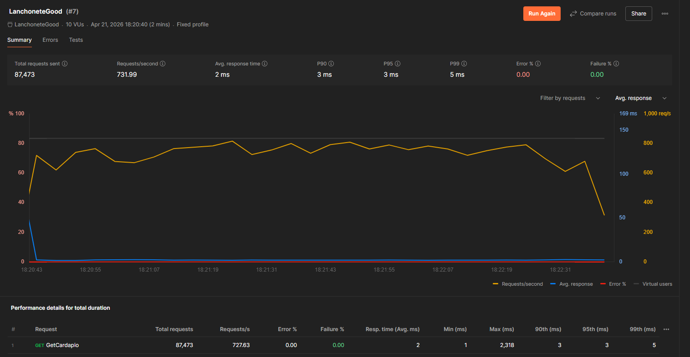
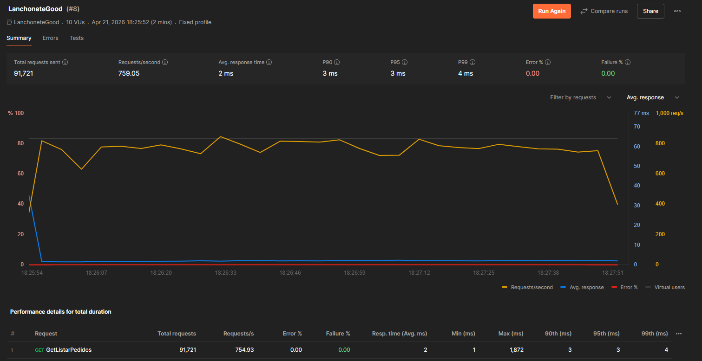
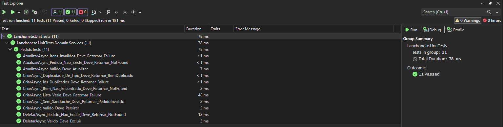
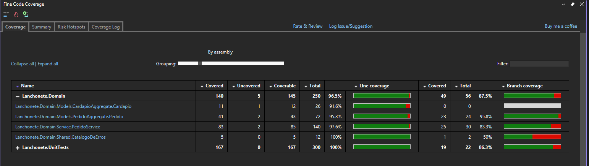
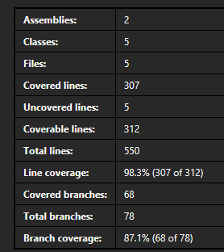

# LanchoneteGood

API REST desenvolvida em .NET 9 para gerenciamento de pedidos de uma lanchonete, com foco em modelagem de domínio, separação de responsabilidades e consistência de regras de negócio.

---

## Problema

A aplicação simula um cenário de pedidos em uma lanchonete, onde o principal desafio não é apenas persistir dados, mas garantir:

- Aplicação correta de regras de desconto
- Validação de composição de pedidos
- Consistência de regras de negócio independente da camada de acesso
- Performance em leitura de dados estáticos (cardápio)

O objetivo da solução é demonstrar organização de código, modelagem de domínio e tomada de decisões técnicas.

---

## Arquitetura

A aplicação segue o padrão **Onion Architecture**, garantindo separação de responsabilidades e isolamento do domínio.

### Estrutura

```
src/
├── Lanchonete.Api
├── Lanchonete.Application
├── Lanchonete.Domain
├── Lanchonete.Infra
tests/
└── Lanchonete.UnitTests
```

---

## Fluxo da Requisição

```
Client
  ↓
Controller
  ↓
MediatR
  ↓
Handler (Application)
  ↓
Domain Service
  ↓
Entity (Regra de Negócio)
  ↓
Repository (Infra)
```

---

### Responsabilidades por Camada

- **Domain**
  - Entidades e agregados
  - Regras de negócio
  - Exceções de domínio
  - Serviços de domínio

- **Application**
  - Casos de uso (Handlers)
  - Orquestração
  - DTOs
  - Cache

- **Infra**
  - Persistência (Entity Framework)
  - Repositórios
  - Configuração de banco

- **Api**
  - Controllers
  - Exposição HTTP
  - Tradução de contratos

---

## Decisões Técnicas

### Domain-Driven Design (DDD)

As regras foram centralizadas na entidade Pedido, garantindo que:

- A lógica não se espalhe por controllers ou handlers
- As invariantes sejam protegidas
- O domínio seja independente de infraestrutura

O domínio é a fonte de verdade das regras, garantindo consistência
independente da forma de acesso (API, testes, etc).

Para cenários simples de CRUD, essa abordagem pode ser considerada overengineering.

---

### MediatR (CQRS leve)

Separação entre leitura e escrita:

- Commands → operações de escrita
- Queries → operações de leitura

Benefícios:

- Baixo acoplamento
- Organização por caso de uso
- Facilidade de testes

---

### Cache

Implementado com `IMemoryCache` e controle de concorrência via `SemaphoreSlim`.

Estratégia:

- Redução de acesso ao banco
- Cenário otimizado para leitura (read-heavy workload)
- TTL: 5 minutos
- Invalidação: manual em alterações de cardápio

---

### Tratamento de Erros

Os erros são tratados na camada de aplicação e convertidos para um formato padrão antes de retornar ao cliente.

Padronização de resposta:

```
{
  "code": "LCG0001",
  "message": "Pedido não encontrado."
}
```

- Centralizado na aplicação
- Facilita consumo por clientes
- Mantém consistência de contrato

---

## Trade-offs

Decisões tomadas considerando o escopo do desafio:

- **IMemoryCache vs Redis**
  - Escolhido pela simplicidade
  - Redis seria necessário em ambiente distribuído

- **CQRS parcial**
  - Separação lógica aplicada
  - Sem segregação física de banco

- **Sem autenticação**
  - Fora do escopo funcional

- **Sem eventos de domínio**
  - Complexidade desnecessária para o cenário

---

## Limitações

- Cache não distribuído
- Sem observabilidade (logs, métricas, tracing)
- Sem testes de integração
- Sem controle de concorrência em banco
- Sem autenticação/autorização

---

## Evolução para Produção

Para um ambiente real, a aplicação exigiria:

- **Escalabilidade**
  - Redis para cache distribuído
  - Estratégias de invalidação (event-driven ou TTL)

- **Observabilidade**
  - Logs estruturados (Serilog)
  - Tracing distribuído (OpenTelemetry)
  - Métricas (Prometheus / Grafana)

- **Resiliência**
  - Retry policies (Polly)
  - Circuit breaker

- **Banco de dados**
  - Concorrência otimista
  - Possível separação read/write

- **Segurança**
  - JWT / OAuth2

- **DevOps**
  - CI/CD
  - Versionamento de API

---

## Regras de Negócio

- Cada pedido pode conter:
  - 1 sanduíche
  - 1 batata
  - 1 refrigerante

- Descontos:
  - Sanduíche + Batata + Refrigerante → 20%
  - Sanduíche + Refrigerante → 15%
  - Sanduíche + Batata → 10%

- Itens duplicados não são permitidos
- Pedido deve conter ao menos um sanduíche

---

## Endpoints

### Cardápio

- GET /api/Cardapio

### Pedido

CRUD de pedidos disponível via /api/Pedido

- GET /api/Pedido
- GET /api/Pedido/{id}
- POST /api/Pedido
- PUT /api/Pedido/{id}
- DELETE /api/Pedido/{id}

---

## Execução do Projeto

### Pré-requisitos

- Docker

### Passos

```bash
git clone https://github.com/cassianobraz/LanchoneteGood.git
cd LanchoneteGood
docker compose up
```

---

Acesse:
http://localhost:4652/scalar

## Performance

### Endpoint: Cardápio

Os testes foram executados em ambiente local, sem latência de rede e sem concorrência distribuída.

Teste realizado com:

- 10 usuários virtuais
- duração: 2 minutos
  

Resultados:

- Requests totais: ~87k
- Throughput: ~730 req/s
- Tempo médio: 2 ms
- P99: 5 ms
- Erros: 0%

### Endpoint: Listar Pedidos



Resultados:

- Requests totais: ~91k
- Throughput: ~750 req/s
- Tempo médio: 2 ms
- P99: 4 ms
- Erros: 0%

---

## Testes

Testes unitários focados no domínio:

- Validação de regras de negócio
- Cenários de erro
- Fluxos de sucesso

## Cobertura





Resultados:

- Line coverage: 98.3%
- Branch coverage: 87.1%
- Linhas cobertas: 307 / 312

---

## Aprendizados

- O uso de DDD trouxe melhor organização e isolamento das regras de negócio,
  porém pode ser considerado excessivo para o problema proposto

- Uma abordagem mais simples (CRUD tradicional) poderia atender o cenário
  com menor complexidade estrutural

- O uso de cache poderia evoluir com estratégias mais robustas de invalidação
  em cenários com múltiplas instâncias

- A separação de responsabilidades melhora testabilidade, mas aumenta o número
  de abstrações e arquivos, exigindo disciplina na manutenção

---

## Considerações Finais

- Regras encapsuladas no domínio
- Baixo acoplamento entre camadas
- Clareza de responsabilidades
- Código preparado para evolução

Este projeto prioriza qualidade de design e clareza arquitetural, mais do que apenas entrega funcional.
